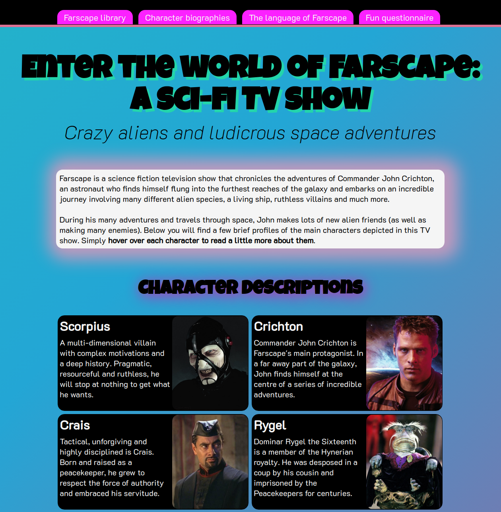
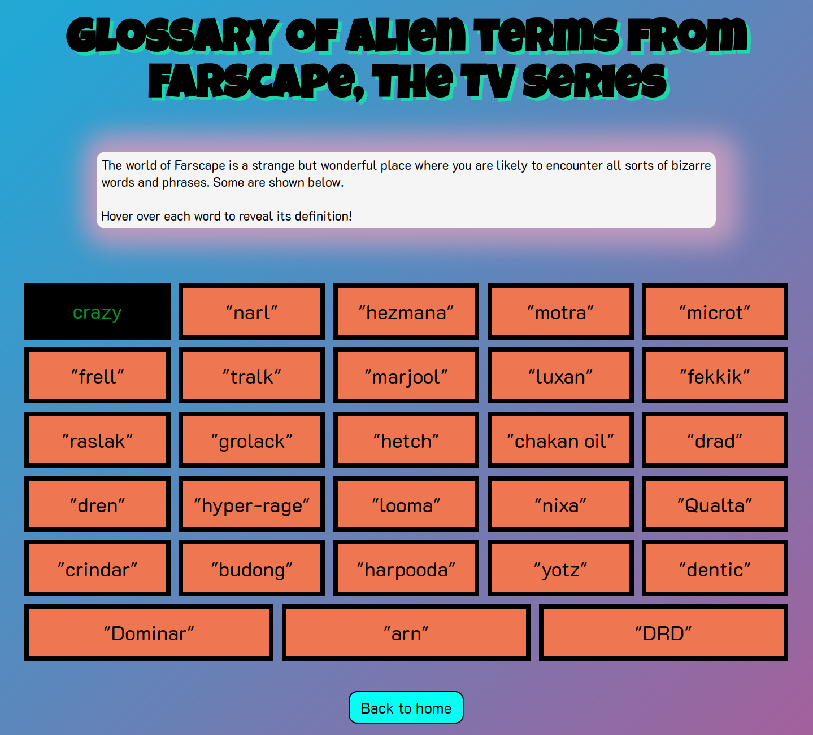
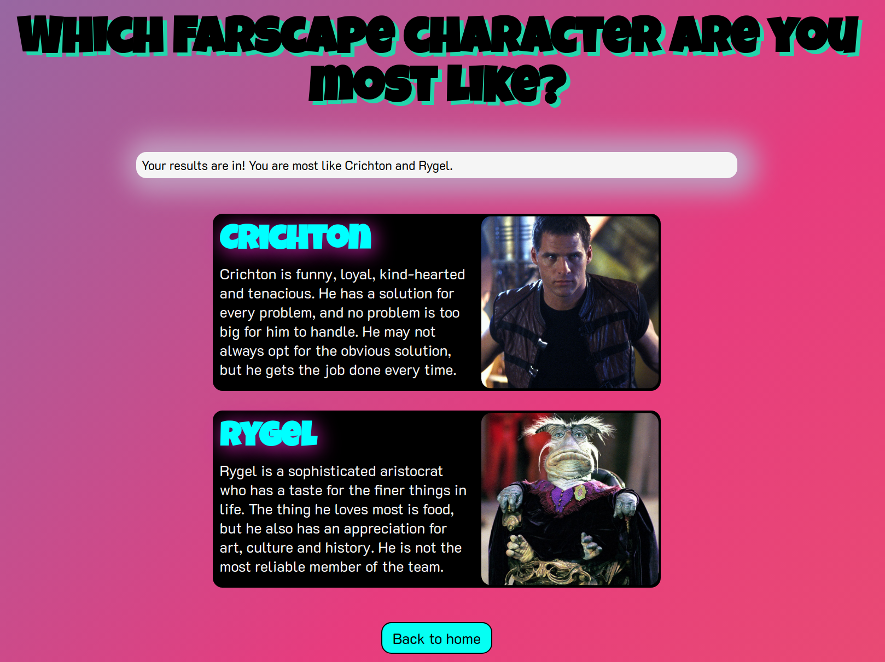

# Responsive web design with **CSS & HTML**

**[Link to my live website](https://3782291211.github.io/HTML-CSS-portfolio-project/)**

_Created on December 2022._

Hello, and welcome! This repository holds all the files for a CSS & HTML project that I have completed. Visit the link above to view and explore my website, or feel free to clone and run the repository in your local environment.

---

## Webpage guide
- In the home page, hover over each character card to view additional information.
- The second page contains a glossary of terms. Hover over each word to reveal its definition.
- The third page contains a questionnaire which is constructed recursively using JavaScript.

---

## Proficiency overview

Here are some of the skills I've demonstrated by completing this project:
- Heavy emphasis on **responsive web design** through extensive use of finely-tuned media queries, relative units and dynamic structures.
- **Interactive CSS** design, through the use of animations, pseudo-elements and pseudo-classes.
- **DOM manipulation** using JavaScript to provide user interactivity.
- Use of developer tools.
   - Responsiveness was tested rigorously on a wide range of specific smartphone and tablet models with varying display dimesions.
   - Performance was tested using rendering tools and analytics, including simulations of severe hardware/network limitations.
---

## Screenshots

